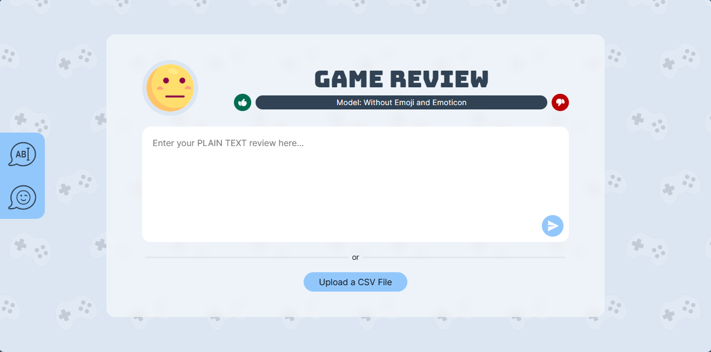
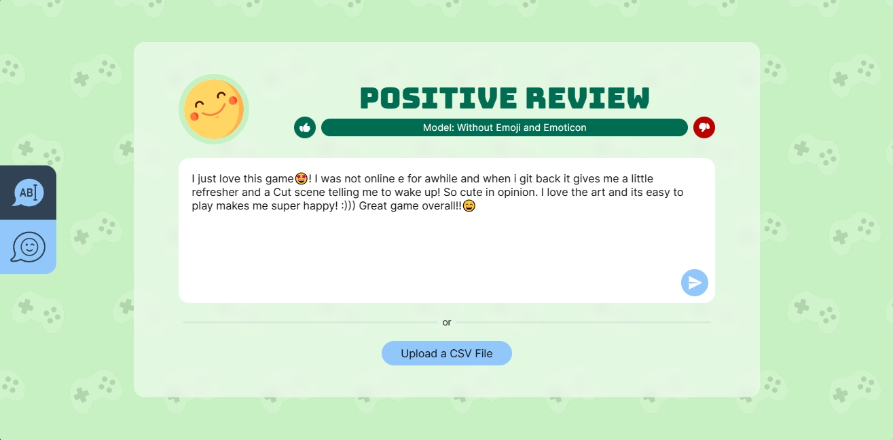
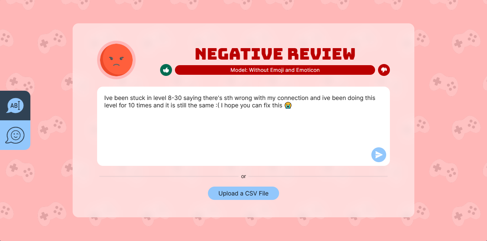
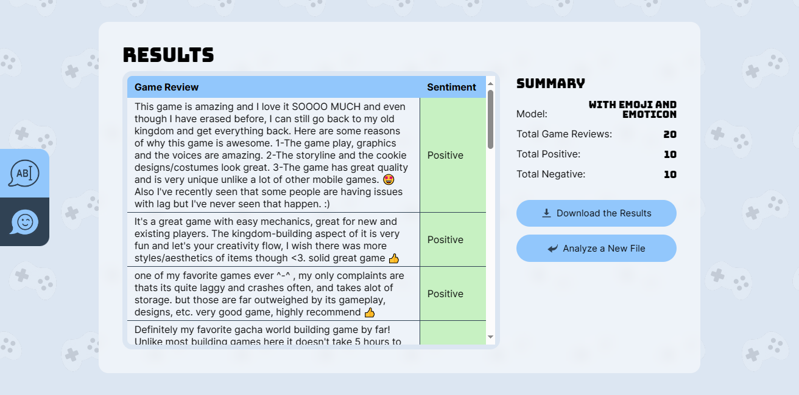

# EmoGameLens: An AI Platform for Analyzing Game Sentiments

A web application for analyzing the sentiment of game reviews.

## Features

- Analyzing a single sentiment
  
  
  
- Analyzing multiple sentiments in a CSV file
  
  

## Authors

- [Jueencess May I. Munsayac](https://github.com/QueencessMay)
- [Jehan S. Batang](https://github.com/prince-bojji)
- [Job Adrian Q. Suaviso](https://github.com/jobadrian)
- [Jon Ray P. Mabalot](https://github.com/FiouReia)

